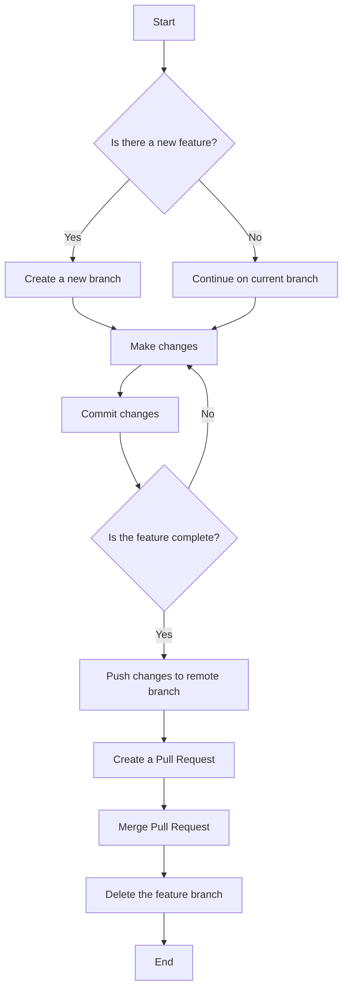

This is a [Next.js](https://nextjs.org) project bootstrapped with [`create-next-app`](https://nextjs.org/docs/app/api-reference/cli/create-next-app).

## Dictionary API Client

This project is a Next.js application that integrates with the Oxford Dictionary API to retrieve dictionary entries for specified words.

### Prerequisites
- Node.js
- npm

### Installation
1. Clone the repository:
   ```bash
   git clone https://github.com/bniladridas/dictionary-api-client
   cd dictionary-api-client
   ```
2. Install dependencies:
   ```bash
   npm install
   ```
3. Create a `.env` file in the root directory and add your API credentials:
   ```
   ACCESS_KEY=your_oxford_api_key
   APP_ID=your_oxford_app_id
   ```

### Running the Application
- Start the development server:
   ```bash
   npm run dev
   ```
- Open your browser and go to `http://localhost:3000`.

## API Integration

### Testing the API
To test the API, you can use the following endpoint:
```
http://localhost:3000/api/dictionary?word=example
```
Replace `example` with any word you want to look up.

### Troubleshooting
If you encounter issues while using the API, follow these steps:
1. **Check API Credentials**: Ensure that your `.env` file contains the correct `ACCESS_KEY` and `APP_ID`.
2. **Verify API Endpoint**: Make sure you are using the correct endpoint format. For example:
   ```
   https://od-api-sandbox.oxforddictionaries.com/api/v2/entries/en-us/{word}
   ```
3. **Test with Known Words**: If you receive a `404 Not Found` error, try testing with common words like `cat`, `dog`, or `apple`.
4. **Check for Sandbox Limitations**: The sandbox environment may not have all entries available. Refer to the Oxford Dictionary API documentation for more details.
5. **Log Errors**: Check the console logs for any error messages that can provide insight into the issue.

## Git Workflow

The following flowchart illustrates the basic Git workflow for pushing changes to a branch:



### Troubleshooting Git Push Issues 🛠️
During the troubleshooting process, the following Git commands were used:
1. **Set the Remote Repository**:
   ```bash
   git remote add origin https://github.com/bniladridas/dictionary-api-client.git
   ```
2. **Push Changes to the Remote**:
   ```bash
   git push origin main
   ```
3. **Update Git Email Configuration** 💡:
   ```bash
   git config --global user.email "your_github_username@users.noreply.github.com"
   ```
4. **Recommit Changes**:
   ```bash
   git commit --amend --reset-author
   ```
5. **Final Push**:
   ```bash
   git push origin main
   ```

These steps ensured that the changes were successfully pushed to the GitHub repository. If you encounter any issues, refer to these commands for troubleshooting! 📋

## Learn More

To learn more about Next.js, take a look at the following resources:

- [Next.js Documentation](https://nextjs.org/docs) - learn about Next.js features and API.
- [Learn Next.js](https://nextjs.org/learn) - an interactive Next.js tutorial.

You can check out [the Next.js GitHub repository](https://github.com/vercel/next.js) - your feedback and contributions are welcome!

## Deploy on Vercel

The easiest way to deploy your Next.js app is to use the [Vercel Platform](https://vercel.com/new?utm_medium=default-template&filter=next.js&utm_source=create-next-app&utm_campaign=create-next-app-readme) from the creators of Next.js.

Check out our [Next.js deployment documentation](https://nextjs.org/docs/app/building-your-application/deploying) for more details.

## Conclusion

This README provides an overview of the project, how to set it up, and how to troubleshoot common issues. If you have any further questions or need assistance, feel free to reach out!

---

Thank you for using the Dictionary API Client!
